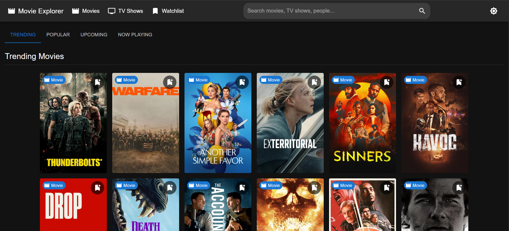

# 🎬 Movie Explorer - TMDB Powered React App

 
*(Add your screenshot image here)*

## 🌟 Project Description
Movie Explorer is a modern, responsive web application built with React that allows users to discover trending movies, TV shows, and actors. Powered by the TMDB API, it offers a sleek interface with dark/light mode, search functionality, and personalized watchlists.

## 🚀 Live Demo
You can check out the live version of the project [here](https://movieapp-n29e.vercel.app/).


## ✨ Key Features

### 🎥 Media Discovery
- 🏠 Home page with trending/popular/upcoming sections
- 🔍 Advanced search across movies, TV shows, and actors
- 📺 Detailed pages for movies, TV shows, and actors

### 🛠 Interactive Features
- 💾 Watchlist with localStorage persistence
- 🌓 Light/Dark mode toggle
- 📱 Fully responsive design
- ⚡ Smooth animations with Framer Motion
- 🎥 Embedded YouTube trailers
- 📊 Rating systems and detailed metadata

### 🛡 Technical Features
- 🔒 Protected watchlist route
- ⏳ Loading skeletons for better UX
- 📦 Lazy-loaded components
- 🔄 Infinite scroll pagination
- 🏷 SEO optimization with React Helmet

## 🛠 Tech Stack

| Category       | Technology                          |
|----------------|-------------------------------------|
| Frontend       | React.js (Vite)                     |
| State Management | Context API                        |
| Styling        | Material UI + Emotion               |
| Routing        | React Router DOM                    |
| API Client     | Axios                               |
| Animation      | Framer Motion                       |
| Icons          | Material Icons + React Icons        |
| API            | The Movie Database (TMDB) API       |

## 📁 Project Structure
movie-explorer/
├── public/
│ └── (static assets)
├── src/
│ ├── assets/ 
│ ├── components/ 
│ │ ├── CastCarousel/
│ │ ├── ErrorBoundary/ 
│ │ ├── Footer/ 
│ │ ├── Header/ 
│ │ ├── MediaCarousel/ 
│ │ ├── MovieCard/ 
│ │ ├── PersonCard/ 
│ │ ├── ScrollToTop/ 
│ │ ├── Search/ 
│ │ ├── SectionHeader/ 
│ │ ├── SEO/ 
│ │ └── SkeletonLoader/
│ ├── contexts/ 
│ ├── hooks/ 
│ ├── pages/ 
│ │ ├── ActorDetails/ 
│ │ ├── Home/ 
│ │ ├── MovieDetails/ 
│ │ ├── NotFound/ 
│ │ ├── SearchResults/ 
│ │ ├── TVDetails/ 
│ │ └── Watchlist/
│ ├── services/
│ ├── styles/ 
│ ├── utils/ 
│ ├── App.jsx 
│ └── main.jsx 
├── .env 
├── package.json 
└── README.md 


## 🏁 Getting Started

### Prerequisites
- Node.js (v14+)
- npm (v6+) or yarn
- TMDB API key

### Installation
1. Clone the repository:
   ```bash
   git clone https://github.com/yourusername/movie-explorer.git
   cd movie-explorer
Install dependencies:

bash
npm install
# or
yarn install
Create a .env file:

env
VITE_TMDB_API_KEY=your_api_key_here
VITE_TMDB_BASE_URL=https://api.themoviedb.org/3
VITE_TMDB_IMAGE_BASE_URL=https://image.tmdb.org/t/p
Run the development server:

bash
npm run dev
# or
yarn dev
🧪 Testing
Run tests with:

bash
npm test
# or
yarn test
🚀 Deployment
Build for production:

bash
npm run build
# or
yarn build
Deploy the dist folder to your preferred hosting service.

📝 License
This project is licensed under the MIT License - see the LICENSE.md file for details.

🙏 Acknowledgments
TMDB for their excellent API

Material UI for awesome React components

Vite team for the blazing fast build tool

📬 Contact
For questions or feedback, please contact Prabhanjan at puranikchetan97@gmail.com

Made with ❤️ by Prabhanjan